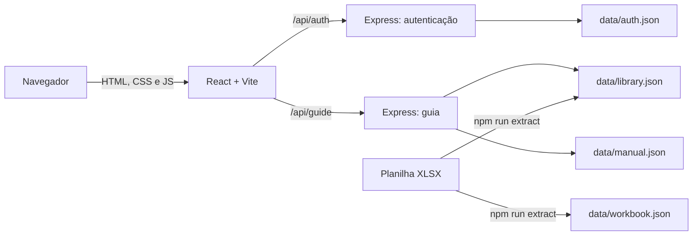

# Arquitetura

## Visão geral

Frontend e API usam a mesma origem. Em desenvolvimento, o Express incorpora o middleware do Vite. Em produção local, `npm start` serve o conteúdo compilado de `dist/` e as rotas da API.

## Componentes

| Arquivo | Responsabilidade |
| --- | --- |
| `server.ts` | Inicialização do Express, middlewares, API, Vite e servidor HTTP |
| `auth.ts` | Credenciais, hash scrypt, JWT, cookie, sessões, logout e limitação de tentativas |
| `guide-api.ts` | Rotas autenticadas de leitura e escrita do guia |
| `guide-store.ts` | Projeção da base, validação e gravação atômica dos cadastros manuais |
| `scripts/extract_workbook.py` | Leitura direta do XML do XLSX e geração dos JSONs |
| `src/auth.tsx` | Estado de sessão no navegador e proteção das páginas |
| `src/App.tsx` | Rotas, consultas, páginas do guia e integração com a API |
| `src/GuideForms.tsx` | Formulários administrativos |
| `src/types.ts` | Tipos do conteúdo extraído |
| `src/guide-types.ts` | Tipos exibidos e editados pelo guia |

## Rotas HTTP

| Método | Rota | Acesso | Função |
| --- | --- | --- | --- |
| `GET` | `/api/health` | Público | Verificação simples do processo |
| `POST` | `/api/auth/login` | Público | Autentica e emite cookie de sessão |
| `GET` | `/api/auth/me` | Sessão | Retorna usuário e expiração |
| `POST` | `/api/auth/logout` | Sessão opcional | Invalida a sessão atual |
| `GET` | `/api/guide` | Sessão | Retorna a projeção operacional |
| `POST` | `/api/guide/professionals` | Administrador | Cria profissional |
| `PUT` | `/api/guide/professionals/:id` | Administrador | Atualiza profissional |
| `PUT` | `/api/guide/units/:id` | Administrador | Atualiza unidade existente |
| `POST` | `/api/guide/exams` | Administrador | Cria exame |
| `PUT` | `/api/guide/exams/:id` | Administrador | Atualiza exame |

Escritas exigem JSON, revisão atual e origem aceita. O campo `revision` implementa concorrência otimista: uma tela desatualizada recebe HTTP 409 em vez de sobrescrever mudanças posteriores.

## Rotas da interface

- `/`: unidades;
- `/unidades/:unitId`: especialidades ou exames da unidade;
- `/unidades/:unitId/especialidades/:specialty`: profissionais da especialidade;
- `/unidades/:unitId/profissionais/:personId`: profissional no contexto da unidade;
- `/unidades/:unitId/exames/:examId`: exame;
- `/profissionais`: cadastro geral;
- `/profissionais/:personId`: vínculos do profissional;
- `/login`: autenticação.

## Modelo de autenticação atual

O servidor lê uma única conta de `data/auth.json`. A senha não é armazenada em texto claro; usa scrypt com salt. O JWT HS256 fica em cookie `HttpOnly`, `SameSite=Strict`, com validade de oito horas. O identificador do token deve existir no `Map` de sessões em memória.

Essa arquitetura funciona em um único processo persistente. Reiniciar o processo invalida todas as sessões. Várias instâncias não compartilham sessões nem tentativas de login.

## Modelo de dados operacional

`library.json` é a base importada e imutável durante o uso normal. `manual.json` contém apenas sobreposições e novos cadastros. A cada leitura, `guide-store.ts` projeta os dois conjuntos em `GuideData`.

As entidades principais são:

- unidade;
- profissional;
- vínculo do profissional com a unidade;
- horário e convênios do vínculo;
- exame vinculado a uma unidade e, opcionalmente, a profissionais;
- catálogo importado de procedimentos.

## Decisões relevantes

- Identidade clínica importada: conselho + número de registro.
- Unidades vêm da base; a interface não cria novas unidades.
- Convênios e horários pertencem ao vínculo entre profissional e unidade.
- O catálogo de procedimentos auxilia o cadastro, mas não prova que um exame é oferecido.
- Dados conflitantes da planilha permanecem associados às respectivas fontes.
- Gravações usam arquivo temporário, sincronização, backup e renomeação atômica.
